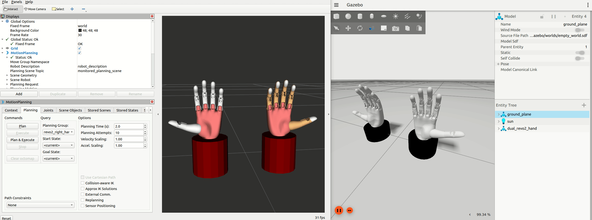

# BrainCo Hand ROS2 Project

[English](README.md) | [简体中文](README_CN.md)


## Project Overview

BrainCo Hand ROS2 is a complete ROS 2 software package collection that provides a full solution for BrainCo Revo2 dexterous hand, from hardware drivers to simulation and motion planning. This project is developed based on ROS 2 Humble, supporting single-hand and dual-hand configurations, providing hardware control, Gazebo simulation, MoveIt motion planning, and other features.

### Key Features

- **Complete Hardware Driver Support**: Supports Modbus, CAN FD, and EtherCAT communication protocols
- **ros2_control Integration**: Complete ros2_control hardware interface implementation
- **Gazebo Simulation Environment**: High-fidelity physics simulation based on Ignition Gazebo 6
- **MoveIt Motion Planning**: Complete MoveIt 2 integration supporting advanced motion planning
- **Real-time Control**: High-frequency control loop for precise finger manipulation
- **Dual-hand Support**: Supports left hand, right hand, and simultaneous dual-hand control
- **Robot Arm Integration**: Provides RM65 robot arm integration demo with Revo2 dexterous hand

## System Requirements

### Basic Environment

- **Operating System**: Ubuntu 22.04
- **ROS Version**: ROS 2 Humble
- **Python Version**: Python 3.8+

### Hardware Requirements (Hardware Control Mode)

#### Modbus Mode (Default)
- Modbus serial device (e.g., `/dev/ttyUSB0`)
- Serial port permission configuration (user must be in `dialout` group)

#### CAN FD Mode (Optional)
- ZLG USB-CAN FD device (e.g., USBCANFD-200U)
- CAN FD bus connection

#### EtherCAT Mode (Optional)
- EtherCAT Master (IgH EtherCAT Master)
- EtherCAT master service configuration (`ethercat` system service)

### Simulation Environment Requirements

- **Gazebo**: Ignition Gazebo 6 (for simulation packages)
- **MoveIt 2**: For motion planning packages

## Project Structure

This project contains the following main packages:

```
brainco_hand_ros2/
├── revo2_description/                    # Revo2 dexterous hand URDF description package
├── brainco_hardware/                     # Hardware driver packages
│   ├── brainco_hand_driver/            # Revo2 dexterous hand hardware driver
│   └── stark_ethercat/brainco_hand_ethercat_driver/                  # EtherCAT driver
├── brainco_gazebo/                      # Gazebo simulation package
├── brainco_moveit_config/               # MoveIt configuration package
└── revo2_with_rm65_demo/                # RM65 robot arm integration demo
    ├── gazebo_rm_65_6f_with_revo2_demo/ # RM65+Revo2 Gazebo simulation
    └── rm65_with_revo2_right_moveit_config/ # RM65+Revo2 MoveIt configuration
```

## Package Descriptions

### 1. revo2_description

**Function**: URDF model description package for Revo2 dexterous hand, providing 3D visualization of the robot model.

**Key Features**:
- Left and right hand URDF models
- RViz visualization support
- Complete joint and link definitions

**Detailed Documentation**: Please refer to [revo2_description/README_CN.md](revo2_description/README_CN.md)

### 2. brainco_hardware

**Function**: Hardware driver package for Revo2 dexterous hand, providing ros2_control-based hardware interface.

**Key Features**:
- Supports Modbus, CAN FD, and EtherCAT communication protocols
- Complete ros2_control hardware interface implementation
- Supports single-hand and dual-hand configurations
- MoveIt integration support
- Real-time joint position and velocity feedback

**Detailed Documentation**: Please refer to [brainco_hardware/brainco_hand_driver/README_CN.md](brainco_hardware/brainco_hand_driver/README_CN.md)

**EtherCAT Detailed Documentation**: Please refer to [brainco_hardware/stark_ethercat/brainco_hand_ethercat_driver/README_CN.md](brainco_hardware/stark_ethercat/brainco_hand_ethercat_driver/README_CN.md)

### 3. brainco_gazebo

**Function**: Gazebo simulation package for Revo2 dexterous hand, providing complete physics simulation environment.

**Key Features**:
- Physics simulation based on Ignition Gazebo 6
- Supports single-hand and dual-hand simulation
- Gazebo-MoveIt integration
- RViz visualization integration

**Detailed Documentation**: Please refer to [brainco_gazebo/README_CN.md](brainco_gazebo/README_CN.md)

### 4. brainco_moveit_config

**Function**: MoveIt configuration package for Revo2 dexterous hand, providing motion planning functionality.

**Key Features**:
- Supports left hand, right hand, and dual-hand configurations
- Complete MoveIt 2 integration
- FakeSystem support

**Detailed Documentation**: Please refer to [brainco_moveit_config/README_CN.md](brainco_moveit_config/README_CN.md)

### 5. revo2_with_rm65_demo

**Function**: Integration demo package for RM65 robot arm with Revo2 dexterous hand.

**Sub-packages**:

#### 5.1 gazebo_rm_65_6f_with_revo2_demo

**Function**: Gazebo simulation for RM65 robot arm with Revo2 dexterous hand.

**Detailed Documentation**: Please refer to [revo2_with_rm65_demo/gazebo_rm_65_6f_with_revo2_demo/README_CN.md](revo2_with_rm65_demo/gazebo_rm_65_6f_with_revo2_demo/README_CN.md)

#### 5.2 rm65_with_revo2_right_moveit_config

**Function**: MoveIt configuration for RM65 robot arm with Revo2 right hand.

**Detailed Documentation**: Please refer to [revo2_with_rm65_demo/rm65_with_revo2_right_moveit_config/README_CN.md](revo2_with_rm65_demo/rm65_with_revo2_right_moveit_config/README_CN.md)

## Quick Start

### 1. Environment Setup

```bash
# Check ROS 2 environment
echo $ROS_DISTRO  # Should output: humble

# Create workspace (if not already created)
mkdir -p <workspace>/src
cd <workspace>
```

**Note**: Please replace `<workspace>` with your workspace path, for example `~/brainco_ws`.

### 2. Clone Repository

```bash
# Enter workspace src directory
cd <workspace>/src

# Clone main repository
git clone https://github.com/BrainCoTech/brainco_hand_ros2.git
cd brainco_hand_ros2

# Use vcs tool to clone dependency repositories
vcs import . < brainco_hand.repos --recursive --skip-existing
```

**Note**: If your system does not have the `vcs` tool installed, please install it first:
```bash
sudo apt-get install python3-vcstool
```

### 3. Install Dependencies and Build

```bash
# Return to workspace root directory
cd <workspace>

# Update package list
sudo apt-get update

# Update rosdep database
rosdep update

# Install all dependencies
rosdep install --from-paths src --ignore-src --rosdistro $ROS_DISTRO -y

```

#### Build

**Method 1: Using Build Script (Recommended, Simple and Convenient)**

```bash
# Default build (CAN FD and EtherCAT disabled)
./build.sh

# Enable CAN FD support
./build.sh --canfd

# Enable EtherCAT support
./build.sh --ethercat

# Enable both CAN FD and EtherCAT
./build.sh --canfd --ethercat

# Release mode build
./build.sh --release

# Release mode with all features enabled
./build.sh --release --canfd --ethercat

# Show help information
./build.sh --help
```

**Method 2: Using colcon Commands**

```bash
# Default build (CAN FD and EtherCAT disabled)
colcon build --symlink-install --packages-ignore stark_ethercat_interface stark_ethercat_driver brainco_hand_ethercat_driver

# Enable CAN FD support
colcon build --symlink-install --cmake-args -DENABLE_CANFD=ON --packages-ignore stark_ethercat_interface stark_ethercat_driver brainco_hand_ethercat_driver

# Enable EtherCAT support
colcon build --symlink-install

# Build brainco_hand_driver package only (default Modbus)
colcon build --packages-up-to brainco_hand_driver --symlink-install
```

**Notes:**
- Enabling CAN FD support requires ZLG USB-CAN FD driver library, please ensure it is correctly placed in `brainco_hardware/brainco_hand_driver/vendor/usbcanfd_xxx/` directory
- If CAN FD support is not enabled, launching nodes with CAN FD protocol will cause errors
- If EtherCAT support is disabled, launching nodes with EtherCAT protocol will cause errors (packages not found)
- Default configuration (CAN FD and EtherCAT disabled) can use Modbus protocol normally
- If you need to use CAN FD or EtherCAT protocol, please enable them through corresponding parameters during build

## Usage Scenarios

### Scenario 1: Hardware Control (Real Dexterous Hand)

If you have real Revo2 dexterous hand hardware, you can use `brainco_hand_driver` for control:

```bash
# Launch right hand system (Modbus mode)
ros2 launch brainco_hand_driver revo2_system.launch.py hand_type:=right

# Launch dual-hand system (Modbus mode)
ros2 launch brainco_hand_driver dual_revo2_system.launch.py

# Launch right hand system (with MoveIt)
ros2 launch brainco_moveit_config revo2_real_moveit.launch.py hand_type:=right

# Launch dual-hand system
ros2 launch brainco_moveit_config dual_revo2_real_moveit.launch.py
```

**Detailed Instructions**: Please refer to [brainco_hardware/brainco_hand_driver/README_CN.md](brainco_hardware/brainco_hand_driver/README_CN.md)

### Scenario 2: Gazebo Simulation

If you want to develop and test without hardware, you can use Gazebo simulation:

```bash
# Launch single-hand simulation
ros2 launch brainco_gazebo revo2_hand_gazebo.launch.py hand_type:=right

# Launch dual-hand simulation
ros2 launch brainco_gazebo dual_revo2_hand_gazebo.launch.py

# Launch simulation with MoveIt
ros2 launch brainco_gazebo revo2_hand_gazebo_moveit.launch.py hand_type:=right
```

**Detailed Instructions**: Please refer to [brainco_gazebo/README_CN.md](brainco_gazebo/README_CN.md)

### Scenario 3: MoveIt Motion Planning (No Hardware)

If you want to use MoveIt for motion planning but don't need hardware or simulation, you can use FakeSystem:

```bash
# Launch right hand MoveIt (FakeSystem)
ros2 launch brainco_moveit_config revo2_right_moveit.launch.py

# Launch dual-hand MoveIt (FakeSystem)
ros2 launch brainco_moveit_config dual_revo2_moveit.launch.py
```

**Detailed Instructions**: Please refer to [brainco_moveit_config/README_CN.md](brainco_moveit_config/README_CN.md)

### Scenario 4: Robot Arm Integration Demo (FakeSystem)

If you want to test the integration of RM65 robot arm with Revo2 dexterous hand:

```bash
# Launch Gazebo simulation
ros2 launch gazebo_rm_65_6f_with_revo2_demo gazebo_rm_65_6f_with_revo2.launch.py

# Launch MoveIt configuration (FakeSystem)
ros2 launch rm65_with_revo2_right_moveit_config rm65_with_revo2_right_moveit.launch.py
```

**Detailed Instructions**:
- [revo2_with_rm65_demo/gazebo_rm_65_6f_with_revo2_demo/README_CN.md](revo2_with_rm65_demo/gazebo_rm_65_6f_with_revo2_demo/README_CN.md)
- [revo2_with_rm65_demo/rm65_with_revo2_right_moveit_config/README_CN.md](revo2_with_rm65_demo/rm65_with_revo2_right_moveit_config/README_CN.md)

## Dual-hand MoveIt Simulation Demo



## Control Interfaces

### Topic Interfaces

All packages provide standard ROS 2 Topic interfaces:

- **Joint States**: `/joint_states` (sensor_msgs/JointState)
- **Trajectory Commands**: `/xxx_revo2_hand_controller/joint_trajectory` (trajectory_msgs/JointTrajectory)

### Action Interfaces

- **Trajectory Execution**: `/xxx_revo2_hand_controller/follow_joint_trajectory` (control_msgs/action/FollowJointTrajectory)

### Control Examples

#### Right Hand Open Palm

```bash
ros2 topic pub --once /right_revo2_hand_controller/joint_trajectory \
  trajectory_msgs/msg/JointTrajectory \
  '{
    joint_names: [
      "right_thumb_proximal_joint",
      "right_thumb_metacarpal_joint",
      "right_index_proximal_joint",
      "right_middle_proximal_joint",
      "right_ring_proximal_joint",
      "right_pinky_proximal_joint"
    ],
    points: [{
      positions: [0.0, 0.0, 0.0, 0.0, 0.0, 0.0],
      time_from_start: {sec: 1}
    }]
  }'
```

#### Right Hand Make Fist

```bash
ros2 topic pub --once /right_revo2_hand_controller/joint_trajectory \
  trajectory_msgs/msg/JointTrajectory \
  '{
    joint_names: [
      "right_thumb_proximal_joint",
      "right_thumb_metacarpal_joint",
      "right_index_proximal_joint",
      "right_middle_proximal_joint",
      "right_ring_proximal_joint",
      "right_pinky_proximal_joint"
    ],
    points: [{
      positions: [0.8, 0.1, 1.4, 1.4, 1.4, 1.4],
      time_from_start: {sec: 2}
    }]
  }'
```

## Monitoring and Debugging

### System Status Check

```bash
# List all running nodes
ros2 node list

# List all controllers
ros2 control list_controllers

# Check hardware components
ros2 control list_hardware_components

# Check hardware interfaces
ros2 control list_hardware_interfaces

# List all topics
ros2 topic list

# List all actions
ros2 action list

# Monitor joint states
ros2 topic echo /joint_states
```

## Contact

For questions or suggestions, please contact the development team.
