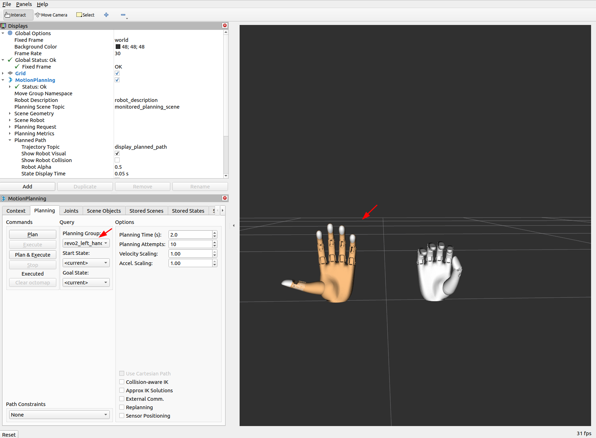
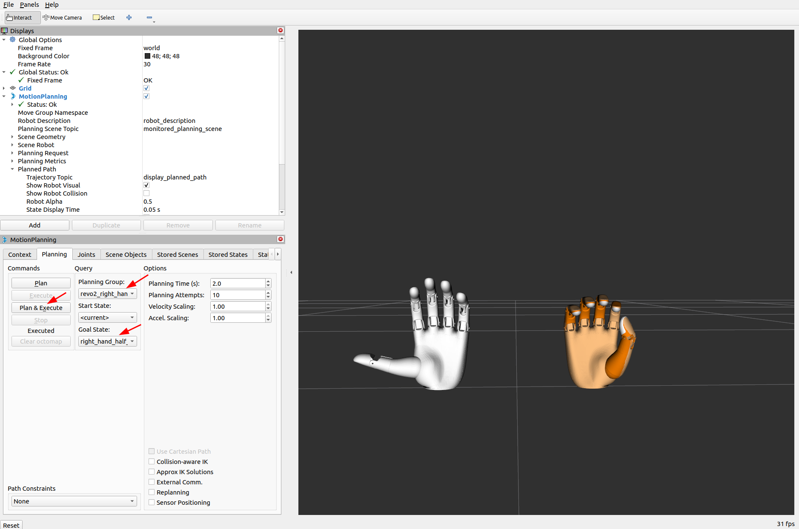
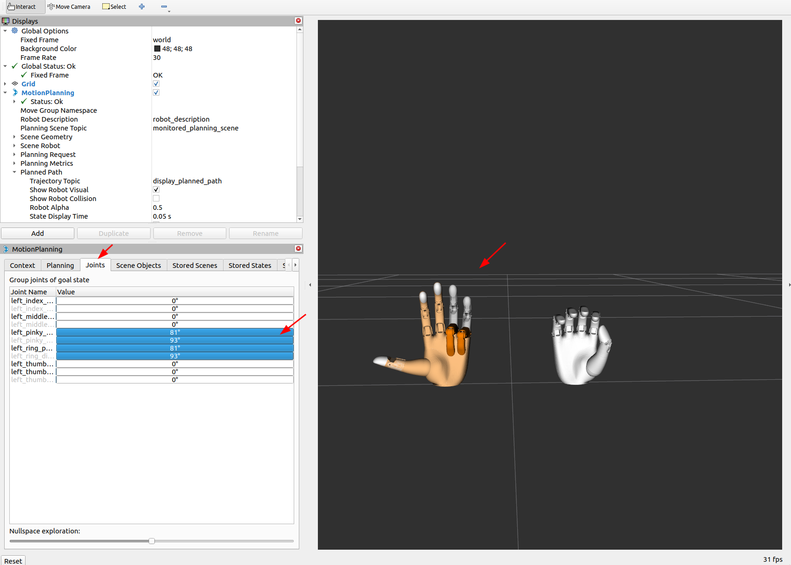
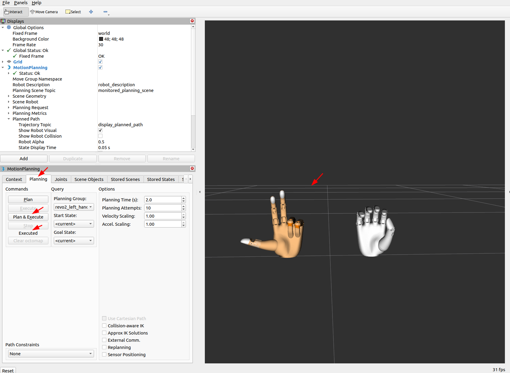

# BrainCo Hand Driver

[English](README.md) | [简体中文](README_CN.md)

## Overview

The BrainCo Hand Driver package provides a ROS2 hardware interface for BrainCo Revo2 dexterous hands using Modbus/CAN FD communication protocols. This package implements a ros2_control hardware interface that enables real-time control and monitoring of 6 finger joints through serial port or CAN FD.

**Communication Protocol Support:**
- **Modbus** (Default): Serial communication with good compatibility and simple deployment
- **CAN FD**: High-speed bus communication, supports controlling multiple hands simultaneously, requires ZLG CAN FD hardware

## Features

- **Communication Protocol**: Support for Modbus and CAN FD dual protocols
- **ros2_control Integration**: Full ros2_control hardware interface implementation
- **Dual Hand Support**: Support for both left and right hand configurations, as well as simultaneous dual-hand control
- **MoveIt Integration**: Optional MoveIt integration for motion planning
- **Real-time Control**: High-frequency control loop for precise finger manipulation
- **State Feedback**: Position and velocity feedback from all joints
- **Trajectory Control**: Joint trajectory controller support for smooth motion execution
- **Auto Detection**: Support for automatic port and slave ID detection (single hand mode only)

## Environment

- Ubuntu 22.04
- ROS 2 (Humble)
- Python 3.8+

### Modbus Mode (Default)
- Modbus serial device (e.g., /dev/ttyUSB0)

### CAN FD Mode (Optional)
- ZLG USB-CAN FD device (e.g., USBCANFD-200U)
- ZLG CAN FD driver library (included with package)
- CAN FD bus connection

## Installation and Setup

### 1. Dependencies

Make sure you have the following packages installed:

```bash
# ROS2 dependencies
sudo apt install ros-humble-controller-manager ros-humble-joint-trajectory-controller
sudo apt install ros-humble-joint-state-broadcaster ros-humble-robot-state-publisher
sudo apt install ros-humble-moveit ros-humble-moveit-ros-planning-interface

# Python dependencies
pip3 install rclpy trajectory_msgs sensor_msgs control_msgs
```

### 2. BrainCo Stark SDK

The BrainCo Stark SDK is included in the `vendor/` directory and can be used directly. To update the SDK version, you can run:

```bash
cd brainco_hardware/brainco_hand_driver
./scripts/download_sdk.sh
```

### 3. Build the Workspace

```bash
# Navigate to workspace
cd ~/brainco_ws

# Install dependencies
rosdep install --ignore-src --from-paths src -y -r

# Build the package
colcon build --packages-select brainco_hand_driver --symlink-install

# Source the workspace
source install/setup.bash
```

### 4. Verify Installation

```bash
# Check if package is available
ros2 pkg list | grep brainco_hand_driver

# Check serial port permissions
ls -l /dev/ttyUSB*
# If permissions are insufficient, add user to dialout group:
sudo usermod -a -G dialout $USER
# Then log out and log back in
```

## Hardware Connection

### Modbus Serial Port Setup

Before using the driver, ensure your Modbus serial port setup is correct:

```bash
# Check serial port devices
ls -l /dev/ttyUSB*

# Check serial port permissions
groups | grep dialout

# If no permission, add user to dialout group
sudo usermod -a -G dialout $USER
# Log out and log back in to take effect

# Test serial port connection (optional)
sudo apt install minicom
sudo minicom -D /dev/ttyUSB0
```

## Quick Start

### Launch Right Hand System

```bash
# Modbus mode (default)
ros2 launch brainco_hand_driver revo2_system.launch.py hand_type:=right

# CAN FD mode (requires ZLG USB-CAN FD device)
ros2 launch brainco_hand_driver revo2_system.launch.py hand_type:=right protocol:=canfd
```

### Launch Left Hand System

```bash
# Modbus mode (default)
ros2 launch brainco_hand_driver revo2_system.launch.py hand_type:=left

# CAN FD mode (requires ZLG USB-CAN FD device)
ros2 launch brainco_hand_driver revo2_system.launch.py hand_type:=left protocol:=canfd
```

### Launch MoveIt Integration

```bash
# Right hand with MoveIt (Modbus mode)
ros2 launch brainco_hand_driver revo2_real_moveit.launch.py hand_type:=right

# Right hand with MoveIt (CAN FD mode)
ros2 launch brainco_hand_driver revo2_real_moveit.launch.py hand_type:=right protocol:=canfd

# Left hand with MoveIt (Modbus mode)
ros2 launch brainco_hand_driver revo2_real_moveit.launch.py hand_type:=left

# Left hand with MoveIt (CAN FD mode)
ros2 launch brainco_hand_driver revo2_real_moveit.launch.py hand_type:=left protocol:=canfd
```

### Launch Dual Hand System (MoveIt)

```bash
# Dual hand system
ros2 launch brainco_hand_driver dual_revo2_real_moveit.launch.py
```

### Launch Parameters

| Parameter | Default | Description |
|-----------|---------|-------------|
| `hand_type` | `right` | Hand type: `left` or `right` |
| `protocol` | `modbus` | Communication protocol: `modbus` or `canfd` |
| `protocol_config_file` | `""` | Protocol configuration file (YAML), leave empty to use default configuration |

## Control Interface

### Using Topic Interface

For right hand trajectory control:

```bash
ros2 topic pub --once /right_revo2_hand_controller/joint_trajectory \
  trajectory_msgs/msg/JointTrajectory \
  '{
    joint_names: [
      "right_thumb_proximal_joint",
      "right_thumb_metacarpal_joint",
      "right_index_proximal_joint",
      "right_middle_proximal_joint",
      "right_ring_proximal_joint",
      "right_pinky_proximal_joint"
    ],
    points: [{
      positions: [0.5, 0.5, 0.5, 0.5, 0.5, 0.5],
      time_from_start: {sec: 2}
    }]
  }'
```

For left hand trajectory control:

```bash
ros2 topic pub --once /left_revo2_hand_controller/joint_trajectory \
  trajectory_msgs/msg/JointTrajectory \
  '{
    joint_names: [
      "left_thumb_proximal_joint",
      "left_thumb_metacarpal_joint",
      "left_index_proximal_joint",
      "left_middle_proximal_joint",
      "left_ring_proximal_joint",
      "left_pinky_proximal_joint"
    ],
    points: [{
      positions: [0.5, 0.5, 0.5, 0.5, 0.5, 0.5],
      time_from_start: {sec: 2}
    }]
  }'
```

### Using Action Interface

For right hand action control:

```bash
ros2 action send_goal /right_revo2_hand_controller/follow_joint_trajectory \
  control_msgs/action/FollowJointTrajectory \
  '{
    trajectory: {
      joint_names: [
        "right_thumb_proximal_joint",
        "right_thumb_metacarpal_joint",
        "right_index_proximal_joint",
        "right_middle_proximal_joint",
        "right_ring_proximal_joint",
        "right_pinky_proximal_joint"
      ],
      points: [
        {
          positions: [0.5, 0.0, 0.0, 0.0, 0.0, 0.0],
          time_from_start: {sec: 1}
        },
        {
          positions: [0.5, 0.0, 1.4, 0.0, 0.0, 0.0],
          time_from_start: {sec: 2}
        },
        {
          positions: [0.5, 0.0, 1.4, 1.4, 0.0, 0.0],
          time_from_start: {sec: 3}
        },
        {
          positions: [0.5, 0.0, 1.4, 1.4, 1.4, 0.0],
          time_from_start: {sec: 4}
        },
        {
          positions: [0.5, 0.0, 1.4, 1.4, 1.4, 1.4],
          time_from_start: {sec: 5}
        }
      ]
    }
  }'
```

For left hand action control:

```bash
ros2 action send_goal /left_revo2_hand_controller/follow_joint_trajectory \
  control_msgs/action/FollowJointTrajectory \
  '{
    trajectory: {
      joint_names: [
        "left_thumb_proximal_joint",
        "left_thumb_metacarpal_joint",
        "left_index_proximal_joint",
        "left_middle_proximal_joint",
        "left_ring_proximal_joint",
        "left_pinky_proximal_joint"
      ],
      points: [
        {
          positions: [0.5, 0.0, 0.0, 0.0, 0.0, 0.0],
          time_from_start: {sec: 1}
        },
        {
          positions: [0.5, 0.0, 1.4, 0.0, 0.0, 0.0],
          time_from_start: {sec: 2}
        },
        {
          positions: [0.5, 0.0, 1.4, 1.4, 0.0, 0.0],
          time_from_start: {sec: 3}
        },
        {
          positions: [0.5, 0.0, 1.4, 1.4, 1.4, 0.0],
          time_from_start: {sec: 4}
        },
        {
          positions: [0.5, 0.0, 1.4, 1.4, 1.4, 1.4],
          time_from_start: {sec: 5}
        }
      ]
    }
  }'
```

### Home Position (Zero Position)

To return to home position:

```bash
# Right hand
ros2 topic pub --once /right_revo2_hand_controller/joint_trajectory \
  trajectory_msgs/msg/JointTrajectory \
  '{
    joint_names: [
      "right_thumb_proximal_joint",
      "right_thumb_metacarpal_joint",
      "right_index_proximal_joint",
      "right_middle_proximal_joint",
      "right_ring_proximal_joint",
      "right_pinky_proximal_joint"
    ],
    points: [{
      positions: [0.0, 0.0, 0.0, 0.0, 0.0, 0.0],
      time_from_start: {sec: 1}
    }]
  }'

# Left hand
ros2 topic pub --once /left_revo2_hand_controller/joint_trajectory \
  trajectory_msgs/msg/JointTrajectory \
  '{
    joint_names: [
      "left_thumb_proximal_joint",
      "left_thumb_metacarpal_joint",
      "left_index_proximal_joint",
      "left_middle_proximal_joint",
      "left_ring_proximal_joint",
      "left_pinky_proximal_joint"
    ],
    points: [{
      positions: [0.0, 0.0, 0.0, 0.0, 0.0, 0.0],
      time_from_start: {sec: 1}
    }]
  }'
```

## Using MoveIt to Control Dexterous Hand

MoveIt provides a graphical interface for easily planning and executing dexterous hand motions.

### Launch MoveIt

First, launch the MoveIt integration:

```bash
# Launch right hand MoveIt
ros2 launch brainco_hand_driver revo2_real_moveit.launch.py hand_type:=right

# Or launch left hand MoveIt
ros2 launch brainco_hand_driver revo2_real_moveit.launch.py hand_type:=left

# Or launch dual hand MoveIt
ros2 launch brainco_hand_driver dual_revo2_real_moveit.launch.py
```

After launching, RViz will automatically open and display the dexterous hand visualization.

### 1. Select Planning Group

In the left panel of RViz, find the "Motion Planning" plugin. First, select the planning group to control:



- For single hand mode: Select `revo2_left_hand` or `revo2_right_hand`
- For dual hand mode: You can select `revo2_left_hand` or `revo2_right_hand` to control left or right hand separately

### 2. Set Goal

In the "Motion Planning" panel, switch to the "Planning" tab, then click "Select Goal State" under "Query" or use the "Joint Values" tab directly:



MoveIt provides predefined poses defined and loaded through `config/xxx.srdf`, which can be selected in the "Query" section of the "Planning" tab:

- **hand_open**: Open hand
- **hand_half_close**: Half close
- **hand_close**: Close hand




### 3. Plan and Execute Motion

After setting the goal, click the "Plan & Execute" button to plan and execute:

- **Plan**: Plan the motion trajectory from current position to target position
- **Execute**: Execute the planned trajectory to control the real dexterous hand
- **Plan & Execute**: Automatically plan and execute

After successful planning, you can see in RViz:
- Green trajectory: Planned motion path
- Orange trajectory: Executed path

### 4. Execution Result

After clicking "Execute", MoveIt will send the trajectory to the controller, and the real dexterous hand will move according to the planned trajectory:



During execution, you can:
- Observe the dexterous hand motion in real-time in RViz
- Monitor joint states through the `/joint_states` topic
- Use `ros2 topic echo /joint_states` to view detailed joint feedback

## Monitoring and Debugging

### Check System Status

```bash
# List all running nodes
ros2 node list

# List all controllers
ros2 control list_controllers

# Check hardware components
ros2 control list_hardware_components

# Check hardware interfaces
ros2 control list_hardware_interfaces

# List all topics
ros2 topic list

# List all actions
ros2 action list

# Monitor joint states
ros2 topic echo /joint_states
```

### Expected Output

#### Core Node List (Right Hand Configuration)
```bash
/controller_manager
/joint_state_broadcaster
/right_revo2_hand_controller
/robot_state_publisher
```

#### Controller Status
```bash
joint_state_broadcaster      joint_state_broadcaster/JointStateBroadcaster          active
right_revo2_hand_controller   joint_trajectory_controller/JointTrajectoryController  active
```

#### Hardware Components (Right Hand Configuration)
```bash
Hardware Component 1
	name: Revo2RightSystem
	type: system
	plugin name: brainco_hand_driver/BraincoHandHardware
	state: id=3 label=active
	command interfaces
		right_thumb_proximal_joint/position [available] [claimed]
		right_thumb_metacarpal_joint/position [available] [claimed]
		right_index_proximal_joint/position [available] [claimed]
		right_middle_proximal_joint/position [available] [claimed]
		right_ring_proximal_joint/position [available] [claimed]
		right_pinky_proximal_joint/position [available] [claimed]
```

#### Hardware Interfaces (Right Hand Configuration)
```bash
command interfaces
	right_index_proximal_joint/position [available] [claimed]
	right_middle_proximal_joint/position [available] [claimed]
	right_pinky_proximal_joint/position [available] [claimed]
	right_ring_proximal_joint/position [available] [claimed]
	right_thumb_metacarpal_joint/position [available] [claimed]
	right_thumb_proximal_joint/position [available] [claimed]
state interfaces
	right_index_proximal_joint/position
	right_index_proximal_joint/velocity
	right_middle_proximal_joint/position
	right_middle_proximal_joint/velocity
	right_pinky_proximal_joint/position
	right_pinky_proximal_joint/velocity
	right_ring_proximal_joint/position
	right_ring_proximal_joint/velocity
	right_thumb_metacarpal_joint/position
	right_thumb_metacarpal_joint/velocity
	right_thumb_proximal_joint/position
	right_thumb_proximal_joint/velocity
```

#### Core Topic List (Right Hand Configuration)
```bash
/joint_states
/right_revo2_hand_controller/joint_trajectory
/robot_description
/tf
/tf_static
```

#### Core Action List (Right Hand Configuration)
```bash
/right_revo2_hand_controller/follow_joint_trajectory
```

## Joint Mapping

### Right Hand Joints

| Joint Name | Description | Angle Range (rad) | Max Angle (deg) |
|------------|-------------|-------------------|-----------------|
| `right_thumb_metacarpal_joint` | Thumb metacarpal joint | 0 ~ 1.57 | 90 |
| `right_thumb_proximal_joint` | Thumb proximal joint | 0 ~ 1.03 | 59 |
| `right_index_proximal_joint` | Index finger proximal joint | 0 ~ 1.41 | 81 |
| `right_middle_proximal_joint` | Middle finger proximal joint | 0 ~ 1.41 | 81 |
| `right_ring_proximal_joint` | Ring finger proximal joint | 0 ~ 1.41 | 81 |
| `right_pinky_proximal_joint` | Pinky finger proximal joint | 0 ~ 1.41 | 81 |

### Left Hand Joints

| Joint Name | Description | Angle Range (rad) | Max Angle (deg) |
|------------|-------------|-------------------|-----------------|
| `left_thumb_metacarpal_joint` | Thumb metacarpal joint | 0 ~ 1.57 | 90 |
| `left_thumb_proximal_joint` | Thumb proximal joint | 0 ~ 1.03 | 59 |
| `left_index_proximal_joint` | Index finger proximal joint | 0 ~ 1.41 | 81 |
| `left_middle_proximal_joint` | Middle finger proximal joint | 0 ~ 1.41 | 81 |
| `left_ring_proximal_joint` | Ring finger proximal joint | 0 ~ 1.41 | 81 |
| `left_pinky_proximal_joint` | Pinky finger proximal joint | 0 ~ 1.41 | 81 |

## Package Structure

```
brainco_hand_driver/
├── launch/                                      # Launch files
│   ├── revo2_system.launch.py                    # Main system launch
│   ├── revo2_real_moveit.launch.py               # MoveIt integration launch (single hand)
│   └── dual_revo2_real_moveit.launch.py          # MoveIt integration launch (dual hand)
├── config/                                      # Configuration files
│   ├── protocol_*.yaml                          # Protocol configuration files (Modbus/CAN FD)
│   ├── xxx.srdf                                 # MoveIt semantic description files
│   ├── xxx.urdf.xacro                           # URDF XACRO files
│   ├── xxx.ros2_control.xacro                   # ros2_control configuration
│   ├── xxx_controllers.yaml                     # Controller configuration
│   ├── xxx_initial_positions.yaml               # Initial positions configuration
│   └── etc.                                     # Other configuration files
├── include/                                     # Header files
│   └── brainco_hand_driver/                     # Driver headers
│       ├── brainco_hand_hardware.hpp            # Hardware interface header
│       └── logger_macros.hpp                   # Logger macros
├── src/                                         # Source files
│   └── brainco_hand_hardware.cpp                # Hardware interface implementation
├── scripts/                                     # Utility scripts
│   └── download_sdk.sh                         # SDK download script
├── vendor/                                      # BrainCo Stark SDK
│   └── dist/                                    # SDK distribution files
├── CMakeLists.txt                               # Build configuration
├── package.xml                                  # Package description
├── brainco_hand_driver_plugins.xml              # Plugin description
└── README.md                                    # This file
```

## License

This project is licensed under the Apache License 2.0 - see the [LICENSE](LICENSE) file for details.

## Contact

If you have any questions or suggestions, please contact the development team.
